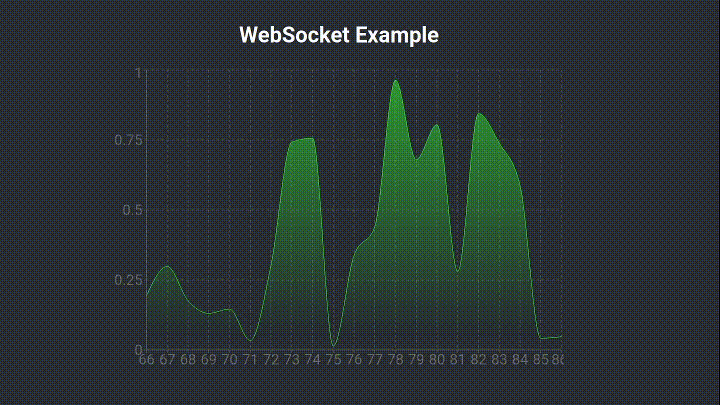

# WebSocket Project

This project was bootstrapped with Create React App.

## Server

The server is implemented with FastAPI. First, install the dependencies:

```
pip install fastapi "uvicorn[standard]"
```

And then, run it:

```
uvicorn run:app --port 8000
```

A server in the localhost:8000 must be created.

## Client

The client is implemented usign React and Recharts.

Go to the websocket directory:

cd websocket
Install the dependencies:

```
npm install
```

And run it:

```
npm start
```

Open the browser in localhost:3000 and you must see a chart being updated every second.


